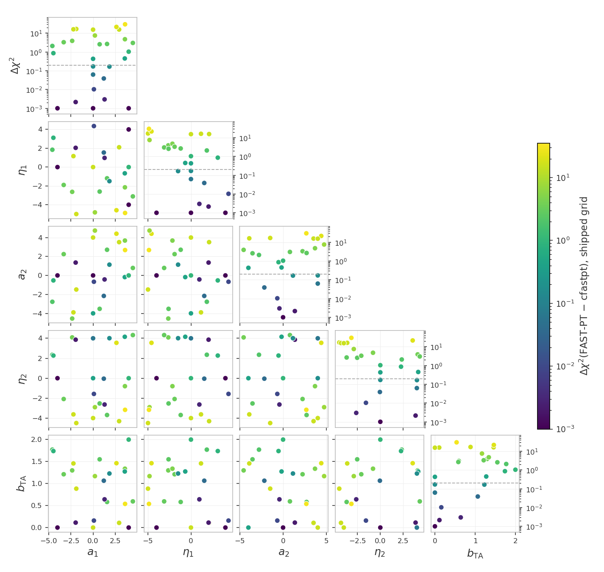
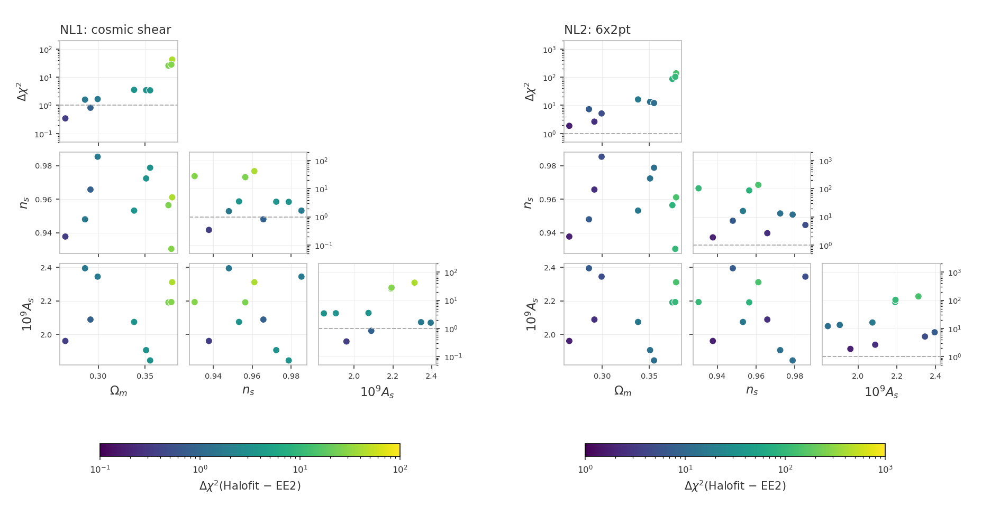
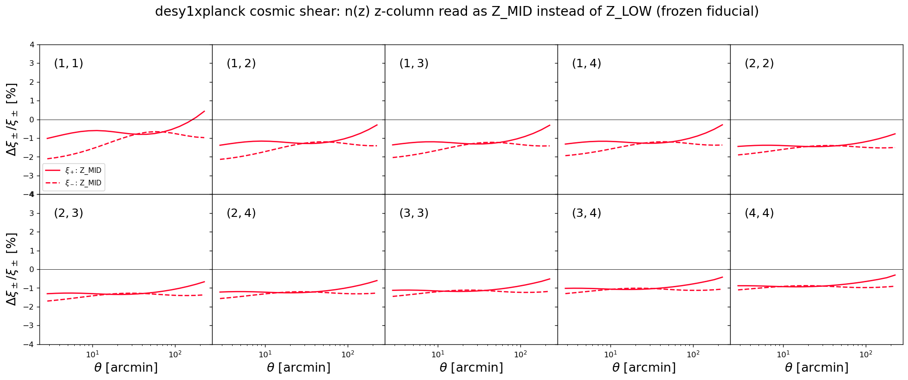
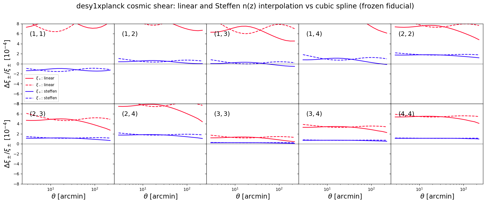

# Unit tests for the likelihoods

These tests catch two kinds of silent breakage: a $\chi^2$ that drifted
because code or data changed by accident, and a race condition (a bug
where evaluating several points in a row corrupts a later result
through leftover internal state or colliding OpenMP threads).

Every model build runs in its own worker subprocess. In this project
both examples share one data set, so the isolation is preventive: it
keeps the tests immune to the process abort that different data-set
dimensions trigger inside cosmolike (desy1xplanck has that layout), and
every project keeps one architecture. The commands below stay the
same.

# Table of contents

1. [Running the tests](#run_tests)
2. [The tests](#the_tests)
    1. [The CFASTPT vs FASTPT comparison](#cfastpt_fastpt)
    2. [The Halofit vs EE2 checks](#halofit_ee2)
    3. [The EE2 race test](#ee2_race)
    4. [Accuracy checks](#accuracy_checks)
    5. [Baryonic feedback accuracy checks](#baryon_accuracy_checks)
    6. [Baryonic feedback drift tests](#baryon_drift_tests)
    7. [The photo-z convention checks](#photoz_conventions)
3. [Appendix](#appendix)
    1. [FAQ: Do the tests keep their own data?](#frozen_copy)
    2. [FAQ: Why do the tests use their own data vectors?](#synthetic_vectors)
    3. [FAQ: How can maintainers refresh the snapshot?](#refreeze)

## Running the tests 

We assume users are in the Conda cocoa environment from a previous
`conda activate cocoa` command, that the shell is bash, and that the
current folder is the cocoa main folder `cocoa/Cocoa`.

**Step :one:**: activate the private Python environment by sourcing
the script `start_cocoa.sh`

    source start_cocoa.sh

**Step :two:**: run the tests of this project

    python -m pytest ./projects/desy1xplanck/tests

Without pytest:

    python -m unittest discover -s ./projects/desy1xplanck/tests -v

The tests change no project files. Each test prints a progress line
per model build and per evaluation, then a report with the
computed $\chi^2$, the stored reference, the difference, and the pass
limit.

A full run performs about 55 likelihood evaluations and takes a
few minutes. The test files force `OMP_NUM_THREADS=4` internally.

## The tests 

The standard configurations get four tests each: a $\chi^2$ drift check
and a race-condition check, both in the NLA and in the TATT intrinsic-alignment
model. The TATT variants set

    IA_model: 1
    DES_A2_1: 0.05
    DES_BTA_1: 0.05
    DES_A2_2: -1.51541

The two checks and their pass limits:

| check | pass limit                                        | a failure means                    |
|-------|---------------------------------------------------|------------------------------------|
| $\Delta\chi^2$ | the recomputed $\chi^2$ must stay within 0.2 of the value stored in `frozen/reference_chi2.json` | code or data changed the numbers |
| race condition | the fiducial evaluated on its own vs evaluated again after nine other cosmologies; the two must agree within $10^{-4}$ | leftover state or an OpenMP race |

Everything the tests compare against lives under `frozen/`: one
snapshot of configurations, data, and reference values, captured
together when the references were generated and unchanged since. The
[Appendix](#appendix) explains how the snapshot is protected.

The test files and the configurations they cover:

| test | file | configuration | what it checks |
|---|---|---|---|
| 1 | `test_example1.py` | cosmic shear; IA modeling: NLA | $\Delta\chi^2$ against the stored reference at the fiducial point |
| 2 | `test_example1.py` | cosmic shear; IA modeling: NLA | race condition (OpenMP threading): fiducial alone vs after nine other cosmologies |
| 3 | `test_example1.py` | cosmic shear; IA modeling: TATT | $\Delta\chi^2$ against the stored reference at the fiducial point |
| 4 | `test_example1.py` | cosmic shear; IA modeling: TATT | race condition (OpenMP threading): fiducial alone vs after nine other cosmologies |
| 5 | `test_example2.py` | 6x2pt; IA modeling: NLA | $\Delta\chi^2$ against the stored reference at the fiducial point |
| 6 | `test_example2.py` | 6x2pt; IA modeling: NLA | race condition (OpenMP threading): fiducial alone vs after nine other cosmologies |
| 7 | `test_example2.py` | 6x2pt; IA modeling: TATT | $\Delta\chi^2$ against the stored reference at the fiducial point |
| 8 | `test_example2.py` | 6x2pt; IA modeling: TATT | race condition (OpenMP threading): fiducial alone vs after nine other cosmologies |
| 11 | `test_example2_2x2pt.py` | 2x2pt (`desy1xplanck.combo_2x2pt`: the 6x2pt configuration reduced to galaxy clustering plus galaxy-galaxy lensing); IA modeling: NLA | $\Delta\chi^2$ against the stored reference at the fiducial point |
| 12 | `test_example2_2x2pt.py` | 2x2pt (`desy1xplanck.combo_2x2pt`: the 6x2pt configuration reduced to galaxy clustering plus galaxy-galaxy lensing); IA modeling: NLA | race condition (OpenMP threading): fiducial alone vs after nine other cosmologies |
| 13 | `test_example2_2x2pt.py` | 2x2pt (`desy1xplanck.combo_2x2pt`: the 6x2pt configuration reduced to galaxy clustering plus galaxy-galaxy lensing); IA modeling: TATT | $\Delta\chi^2$ against the stored reference at the fiducial point |
| 14 | `test_example2_2x2pt.py` | 2x2pt (`desy1xplanck.combo_2x2pt`: the 6x2pt configuration reduced to galaxy clustering plus galaxy-galaxy lensing); IA modeling: TATT | race condition (OpenMP threading): fiducial alone vs after nine other cosmologies |
| 15 | `test_fastpt.py` | cosmic shear; IA modeling: TATT; the C cfastpt (`IA_code: 0`) vs the python FAST-PT package (`IA_code: 1`) at 30 fixed points (20 across the intrinsic-alignment prior plus a one-parameter-at-a-time family), cosmology at the fiducial | $\Delta\chi^2$ of the FAST-PT data vector against the cfastpt data vector at the same point; the cfastpt vector is that point's fiducial, so agreement means zero |
| 16 | `test_fastpt.py` | 6x2pt; IA modeling: TATT; the same comparison as test 15 on the 6x2pt likelihood (`desy1xplanck.combo_6x2pt`) | the same pass rule as test 15, with the data-vector difference weighted by the 6x2pt masked inverse covariance |
| 17 | `test_fastpt.py` | 2x2pt; IA modeling: TATT; the same comparison as test 15 on the 2x2pt likelihood (`desy1xplanck.combo_2x2pt`) | the same pass rule as test 15; clustering carries no intrinsic alignment, so the TATT tables enter through galaxy-galaxy lensing alone, weighted by the 2x2pt masked inverse covariance |
| 18 | `test_ee2.py` | cosmic shear; NLA with EE2 (`non_linear_emul: 1`) | race condition (OpenMP threading, including EE2's own threaded compute): fiducial alone vs after nine other cosmologies |

### The CFASTPT vs FASTPT comparison (`test_fastpt.py`, tests 15-17) 

Cosmolike computes the TATT perturbation-theory integrals with two
implementations: cfastpt, the C code built into the interface
(`IA_code: 0`), and the python FAST-PT package through the fastpt
theory block (`IA_code: 1`). Both are evaluated at 30 fixed points
across the intrinsic-alignment prior and checked for agreement:
test 15 on cosmic shear, test 16 on the 6x2pt likelihood, test 17
on the 2x2pt likelihood.

At every point the cfastpt data vector is the fiducial: the reported
quantity is the $\Delta\chi^2$ of the FAST-PT vector against it,
zero for identical vectors and quadratic in their difference. A
comparison against the shipped data vector would measure the slope
of the distance to the data instead of the numerics.

The fastpt block computes on two grids: `accuracyboost` multiplies
the density of the output table cosmolike reads with linear
interpolation (the accuracy driver), and `internal_accuracyboost`
the density of the internal grid the FFTLog convolutions run on,
with a cubic spline in log k upsampling the terms from one grid
onto the other.

Both boosts are rebased so 1.0 is the converged configuration. The
tests run FAST-PT at the defaults with the 0.2 band of the other
checks as the pass limit; a doubled configuration repeats the
measurement as an advisory.

In test 16 the TATT terms also enter galaxy-galaxy lensing, and the
difference is weighted by the 6x2pt masked inverse covariance. The
frozen configuration fixes the one-loop bias amplitudes
(`DES_B2_*`) at zero, so the one-loop galaxy-bias tables both
implementations compute multiply by zero, and the CMB-lensing
cross-correlations carry only the linear (A1) alignment term: the
sweep scores the intrinsic-alignment tables alone, on the wider
data vector.

Test 17 repeats the sweep on the 2x2pt likelihood. Clustering
carries no intrinsic alignment, so there the TATT tables are scored
through galaxy-galaxy lensing alone, under the 2x2pt masked
inverse covariance.

> [!NOTE]
> Before the two-grid upgrade of the fastpt theory block (2026-09)
> there was no upsampling and the difference reached
> $\Delta\chi^2 = 29.6$ across the prior.

The point values, the design, and the decision record live with the
lsst_y1 project (its tests/README.md carries the full discussion);
the table below is this project's own measurement:

| output table (points) | internal grid (points) | max $\Delta\chi^2$ | cost per cosmology |
|---|---|---|---|
| 1,100 | 1,100 (shared) | 29.6 | 1.1 s |
| 1,024,900 (`accuracyboost: 1`, the default) | 1,100 (the default) | 0.000239 | 1.4 s |
| 2,048,900 (`accuracyboost: 2`) | 1,300 (`internal_accuracyboost: 2`) | 0.000170 | 1.7 s |

Measured on 2026-09-23:

- Test 16 (6x2pt): max $\Delta\chi^2 = 0.000245$ at the defaults,
  $0.000134$ at the pushed camb/cosmolike settings,
  indistinguishable from cosmic shear's 0.000239 at the same points
  under the 6x2pt masked covariance.
- Test 17 (2x2pt): $0.000008$ and $0.000003$, the mildest of the
  three, with the TATT tables entering through galaxy-galaxy
  lensing alone.
- `--mask=ones` (no scale cuts, all 1,809 points weighted): cosmic
  shear measures max $\Delta\chi^2 = 0.004813$ at the default
  camb/cosmolike settings and $0.000224$ at the pushed settings;
  2x2pt measures $0.003061$ and $0.000249$. Every run stays well
  inside the 0.2 band.

> [!Warning]
> The 6x2pt sweep cannot run under `--mask=ones` (2026-09-23): with
> every point unmasked the shipped 6x2pt covariance is not positive
> definite (67 non-positive eigenvalues on the full 1,809-point
> matrix; under the frozen 738-point mask it is positive definite)
> and cosmolike aborts the model build (`IP::set_inv_cov`). Test 16
> therefore fails under this mask; tests 15 and 17 run.

> [!NOTE]
> The fastpt defaults hold this accuracy on their own; raising the
> boosts is a convergence test, not a need. cfastpt (`IA_code: 0`)
> remains the reference implementation.

#### Running the comparison 

We assume users are in the Conda cocoa environment from a previous
`conda activate cocoa` command, that the shell is bash, and that the
current folder is the cocoa main folder `cocoa/Cocoa`.

**Step :one:**: activate the private Python environment by sourcing
the script `start_cocoa.sh`

    source start_cocoa.sh

**Step :two:**: run the comparison at the default camb/cosmolike
settings

    python -m pytest ./projects/desy1xplanck/tests/test_fastpt.py

**Step :three:**: repeat it at the pushed camb/cosmolike settings

    python -m pytest ./projects/desy1xplanck/tests/test_fastpt.py --high=1

> [!NOTE]
> `--high=1`: applies the pushed camb/cosmolike settings of the
> accuracy checks to every block of tests 15-17 (the other tests do
> not read it). The full comparison is both invocations.

> [!NOTE]
> `--mask`: reruns tests 15-17 under a different scale-cut mask.
> `--mask=frozen` (the default) keeps the shipped 6x2pt mask of the
> frozen contract (738 of the 1,809 data points); `--mask=ones`
> keeps every point (no scale cuts), the strictest comparison. Each
> choice is a frozen TATT dataset variant differing only in its
> `mask_file` line, and the 0.2 pass rule applies unchanged. The
> 6x2pt sweep aborts under `ones` (see the warning above).

### The Halofit vs EE2 checks (`test_nonlinear.py`, NL1-NL2) 

The likelihoods can source the nonlinear matter power from CAMB's
Takahashi halofit (`non_linear_emul: 2`, the frozen contracts'
setting) or from EuclidEmulator2 (`non_linear_emul: 1`). Check NL1
evaluates the cosmic-shear data vector with both at ten fixed
cosmologies across the omegam/ns/As space (every other parameter at
the frozen fiducial); check NL2 repeats the sweep on the 6x2pt
likelihood (`desy1xplanck.combo_6x2pt`).

Each check reports, per cosmology, the $\Delta\chi^2$ of the
Halofit vector against the EE2 vector. The EE2 vector is that
cosmology's fiducial, so the baseline is zero by construction and
no stored data vector enters the metric.

The checks are advisory - there is no pass limit: the numbers say
how much of the statistical error budget the Halofit-vs-emulator
difference consumes under the chosen scale cuts, the question "can
Halofit be used on real data analysis at this mask".

The `--mask` option of the comparison sweeps applies:
`--mask=frozen` (the default) keeps the shipped 6x2pt mask of the
frozen contract (738 of the 1,809 data points); `--mask=ones` keeps
every point (no scale cuts). NL2 cannot run under `ones`: the fully
unmasked 6x2pt covariance is not positive definite and cosmolike
aborts the model build, as the warning in the CFASTPT section
describes for test 16.

Measured on 2026-09-23 (the figure below, frozen mask):

- NL1 (cosmic shear): per-cosmology $\Delta\chi^2$ between 0.3 and
  42.2 (median 3.4) under the frozen mask, and between 0.4 and 71.2
  (median 6.2) under `--mask=ones`.
- NL2 (6x2pt): between 1.9 and 137.2 (median 12.7) under the frozen
  mask, its only measurement; the run under `--mask=ones` ends in
  the abort described above (`IP::set_inv_cov: masked cov not
  positive definite`).
- Every sweep peaks at the high-omegam draws; at these ten
  cosmologies the two nonlinear-P(k) sources are not
  interchangeable at this project's precision even under the frozen
  scale cuts.

#### Running the Halofit vs EE2 checks 

We assume users are in the Conda cocoa environment from a previous
`conda activate cocoa` command, that the shell is bash, and that the
current folder is the cocoa main folder `cocoa/Cocoa`.

**Step :one:**: activate the private Python environment by sourcing
the script `start_cocoa.sh`

    source start_cocoa.sh

**Step :two:**: run the checks under the frozen scale cuts

    python -m pytest ./projects/desy1xplanck/tests/test_nonlinear.py

**Step :three:**: repeat them with every data point kept

    python -m pytest ./projects/desy1xplanck/tests/test_nonlinear.py --mask=ones

### The EE2 race test (`test_ee2.py`, test 18) 

Cocoa pins a modified EuclidEmulator2: OpenMP threading, a
1,010-redshift capacity, the `get_boost2` API with a pre-built
emulator, memory-leak fixes, and a bilinear interpolation with a
border fix. The modifications and their measured speed-up are
documented in the repository's own README
(`external_modules/code/euclidemu2/README.md`).

Test 18 is the race check with EE2 on: the fiducial evaluated
fresh and again as the 10th of 10 cosmologies on one model
instance, with the nonlinear $P(k)$ from EE2. EE2's compute is
OpenMP-threaded, so a thread race inside it shifts the second
fiducial value; the two must agree within $10^{-4}$.

The modification gate - the pre-modification build (commit
`ff59f66`) compiled side by side and compared against the
installed one, data vector by data vector - runs as lsst_y1's
test 18; the modifications do not depend on the project, so one
gate serves every project.

Measured on 2026-09-23:

- Test 18: the fresh and 10th-in-a-row fiducial agree to all eight
  printed decimals.
- The gate's side-by-side comparison, run against this project's
  cosmic shear under its frozen mask (ten cosmologies): max
  $\Delta\chi^2 = 7.2\times10^{-7}$, with a max fractional
  data-vector difference of $1.7\times10^{-5}$.

### Accuracy checks (`test_accuracy.py`, A1-A6) 

We change one accuracy parameter at a time on the 6x2pt NLA
configuration, then checks A1-A6 re-evaluate cosmic shear, 6x2pt,
and 2x2pt, with NLA and TATT, with every setting pushed far beyond
the defaults at once. The scan keeps an `accuracyboost: 5` entry as
a deliberate stress test: in this project it breaks the 6x2pt
integration tables and produces a $\Delta\chi^2$ of +27, so it
stays out of the raised-at-once set below.

| setting | raised to | what it controls |
|---------|-----------|------------------|
| `accuracyboost` (cosmolike) | 2 | sizes of cosmolike's internal lookup tables, including the dyadic z grid of the power-spectrum tables |
| `integration_accuracy` (cosmolike) | 10 | extra refinement passes of cosmolike's numerical integrals |
| `internal_accuracyboost` (cosmolike) | 2 | density of the C-FAST-PT convolution grid relative to the output table the likelihood interpolates; 1 is the legacy single-grid path |
| `lmax` (cosmolike) | 200000 | highest multipole of the internal harmonic-space $C_\ell$ tables that cosmolike transforms into the real-space correlation functions; arcminute scales need very high $\ell$ |
| `kmax_boltzmann` (cosmolike) | 40 | the k cutoff of the power spectrum the likelihood requests from CAMB |
| `AccuracyBoost` (CAMB) | 2 | CAMB's overall accuracy multiplier: denser sampling in every internal CAMB grid, the most expensive setting |
| `k_per_logint` (CAMB) | 50 | k samples CAMB computes per logarithmic interval of the transfer functions |
| `kmax` (CAMB) | 50 | highest k of CAMB's matter power spectrum; one physical cutoff with `kmax_boltzmann`, seen from the CAMB side |

`accuracyboost` refines a nested z grid in the power-spectrum
tables: every coarser grid's nodes are a subset of every finer
grid's, so a higher boost tightens the same interpolation instead of
moving the nodes (the construction is commented in
`likelihood/_cosmolike_prototype_base.py`).

`internal_accuracyboost` scales only the C-FAST-PT convolution
grid; the output table the likelihood interpolates is unchanged.

- 2026-09-25: the 0.5 default is converged. The lsst_y1 scan
  measured $\Delta^T C^{-1} \Delta \le 10^{-9}$ against the
  single-grid path down to 0.27, and `internal_accuracyboost: 1`
  recovers that path exactly.

When several settings move the $\chi^2$, settle them in cost order:
raise cosmolike `accuracyboost` first (cheap), then CAMB
`k_per_logint`, and CAMB `AccuracyBoost` last (expensive at run
time, and able to masquerade for the cheap settings).
`kmax_boltzmann` and CAMB `kmax` are one physical cutoff seen from
two sides; move them together.

Each check reports the $\Delta\chi^2$ between the high-accuracy and
the default evaluations: the numerical error of the default
settings. No pass/fail.

> [!NOTE]
> High-accuracy evaluations take minutes.

#### Running Accuracy checks 

We assume users are in the Conda cocoa environment from a previous
`conda activate cocoa` command, that the shell is bash, and that the
current folder is the cocoa main folder `cocoa/Cocoa`.

**Step :one:**: activate the private Python environment by sourcing
the script `start_cocoa.sh`

    source start_cocoa.sh

**Step :two:**: run the accuracy checks on their own

    python -m pytest ./projects/desy1xplanck/tests/test_accuracy.py

To run every other test while skipping these:

    python -m pytest ./projects/desy1xplanck/tests --ignore ./projects/desy1xplanck/tests/test_accuracy.py

### Baryonic feedback accuracy checks (`test_accuracy_baryons.py`, BF1-BF7) 

The file `test_accuracy_baryons.py` repeats the default-versus-high
accuracy comparison with the `bfmt` theory block switched on: one
advisory check per feedback method (the three SP(k) fb relations,
BCEmu, Flamingo, BACCOemu, and BCemu2025), at a fixed parameter
point per method.

Each check creates its data vector on the fly, by the same
mechanism as the N-random-models check: the default-settings model
writes its own theory vector during evaluation, that vector becomes
the data of a temporary dataset, and the pushed-settings model
evaluates at the same point against it. The fiducial $\chi^2$ is
therefore zero by construction, nothing is stored in the snapshot,
and the single reported number, $\Delta\chi^2$, is a pure numerics
response.

The check BF0 additionally runs the one-setting-at-a-time scan with
the Akino SP(k) feedback on, so a large delta names the setting
causing it.

Every checked configuration is measurable by construction. The
BACCOemu check evaluates with `omegab: 0.049`, inside that
emulator's baryon-density training box, whose floor sits exactly
above the fiducial `omegab: 0.04`; and the double-power-law point is
chosen to keep the baryon fraction inside SP(k)'s calibrated band
over the full redshift grid.

#### Running the baryonic feedback checks 

We assume users are in the Conda cocoa environment from a previous
`conda activate cocoa` command, that the shell is bash, and that the
current folder is the cocoa main folder `cocoa/Cocoa`.

**Step :one:**: activate the private Python environment by sourcing
the script `start_cocoa.sh`

    source start_cocoa.sh

**Step :two:**: run the baryonic feedback checks of this project

    python -m pytest ./projects/desy1xplanck/tests/test_accuracy_baryons.py

### Baryonic feedback drift tests (`test_baryons.py`, BD1-BD7) 

The file `test_baryons.py` pins the feedback pipeline against change
over time, one test per method. Each method's default-settings
theory prediction was stored at freeze time
(`generate_frozen_reference.py --baryons`), and the test evaluates
today's prediction against that stored vector: zero at freeze time
by construction, so a $\chi^2$ above the tolerance means cosmolike
or the `bfmt` theory block changed its prediction since the freeze.

These tests complement the accuracy checks above: the accuracy
checks regenerate their vector on the fly per run, so they measure
the numerical settings and can never see drift; the drift tests hold
the frozen vector still, so they measure drift and nothing else.

#### Running the baryonic feedback drift tests 

We assume users are in the Conda cocoa environment from a previous
`conda activate cocoa` command, that the shell is bash, and that the
current folder is the cocoa main folder `cocoa/Cocoa`.

**Step :one:**: activate the private Python environment by sourcing
the script `start_cocoa.sh`

    source start_cocoa.sh

**Step :two:**: run the drift tests of this project

    python -m pytest ./projects/desy1xplanck/tests/test_baryons.py

### The photo-z convention checks (`test_photoz_conventions.py`) 

The likelihood exposes two runtime knobs for how the n(z) table files
become the smooth distributions the Limber integrals consume, both
declared in the likelihood yamls and both defaulting to the
historical behavior: `photoz_interpolation_type` (0 = cubic spline,
1 = linear, 2+ = Steffen monotone, which cannot overshoot below zero
around a sharp feature in the table) and `photoz_zmid_convention`
(0 = the z column of the n(z) file holds Z_LOW left bin edges, so
the tabulated value belongs at the cell center z + dz/2; 1 = the
column holds Z_MID sample points). The two z-column readings differ
by a rigid dz/2 shift of every distribution.

The test evaluates the frozen cosmic-shear fiducial under five
settings in one process - the default, each alternative, and the
default again - and measures every alternative against the default
with the same second-order construction the CFASTPT sweep uses:
$\Delta\chi^2 = \delta^T C^{-1} \delta$, with $\delta$ the
data-vector difference and $C^{-1}$ the masked inverse covariance.
The assertions are a dead-flag floor on each alternative (a stale
n(z) cache would give exactly zero), the frozen-reference check on
the default, and a bit-identical round trip back to the default (a
cache that fails to rebuild on the way back would fail loudly).

Measured on 2026-09-25:

- default: $\chi^2 = 0.000000$ (the frozen reference exactly).
- linear: $\Delta\chi^2 = 1.3\times10^{-3}$; Steffen:
  $\Delta\chi^2 = 5.7\times10^{-5}$. Either interpolant change is far below
  the survey's statistical precision.
- Z_MID: $\Delta\chi^2 = 0.42$ - the half-bin z-column reading
  is the one photo-z convention that matters at this precision.

The figures below are regenerated by
`generate_photoz_convention_figure.py`:

# Appendix 

## :interrobang: FAQ: Do the tests keep their own data? 

The tests read nothing from the live project: not `../data`, not the
`EXAMPLE_EVALUATE` yaml files, and not the likelihood default yaml
files. Instead, `frozen/` holds:

| `frozen/` entry | holds |
|---|---|
| `frozen_config_example{1,2}.py` | the complete cobaya configuration as a yaml string, plus the exact evaluation point |
| `data/` | the tests' own copy of the data vectors, covariance, n(z), and masks |
| `EXAMPLE_EVALUATE{1,2}.yaml` | snapshots kept only so a human can diff how the live examples drifted since the freeze |

In the configuration modules every option and every parameter is
written out, including the ones that normally come from
`params_source.yaml` and the other default files, so editing those
files cannot change what the tests evaluate.

`manifest_sha256.json` stores a SHA-256 hash (a fingerprint that
changes when any byte changes) of every file under `frozen/`. Each test
verifies the manifest first and refuses to run when a file under `frozen/` was
edited, naming the file. The result: users may change the live data
and examples freely, and nobody can quietly edit the snapshot
either.

## :interrobang: FAQ: Why do the tests use their own data vectors? 

This project's shipped data vector is real data, and the example
cosmology is not its best fit, so the $\chi^2$ there sits far from the
minimum, where it responds linearly to tiny numerical changes.

Every variant therefore evaluates against a data vector generated
at the fiducial point when the snapshot was created:
`frozen/data/synthetic_desy1xplanck.dataset`
(default NLA model) for the NLA tests and
`frozen/data/tatt_desy1xplanck.dataset` (TATT model) for the TATT tests.

Both come from the 6x2pt model, whose full-length vector
serves every probe; at its own minimum the $\chi^2$ response is quadratic
and the drift and accuracy numbers stay meaningful.

## :interrobang: FAQ: How can maintainers refresh the snapshot? 

A deliberate change to the data vectors, n(z), covariance, examples,
or likelihood defaults requires a re-freeze.

We assume users are in the Conda cocoa environment from a previous
`conda activate cocoa` command, that the shell is bash, and that the
current folder is the cocoa main folder `cocoa/Cocoa`.

**Step :one:**: activate the private Python environment by sourcing
the script `start_cocoa.sh`

    source start_cocoa.sh

**Step :two:**: rebuild the snapshot

    python ./projects/desy1xplanck/tests/generate_frozen_reference.py --overwrite

It rebuilds `frozen/` from the current project, prints the four new
reference $\chi^2$ values, and rewrites the manifest. Review the printed
$\chi^2$ values against the old references before committing: they define
what every later test run compares against.
